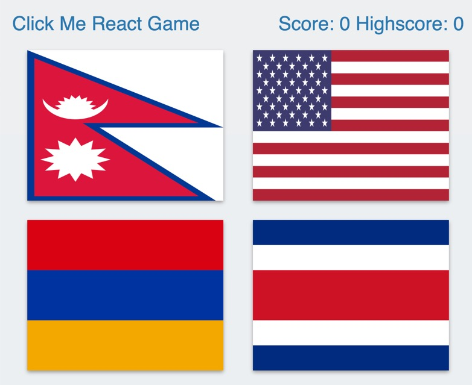
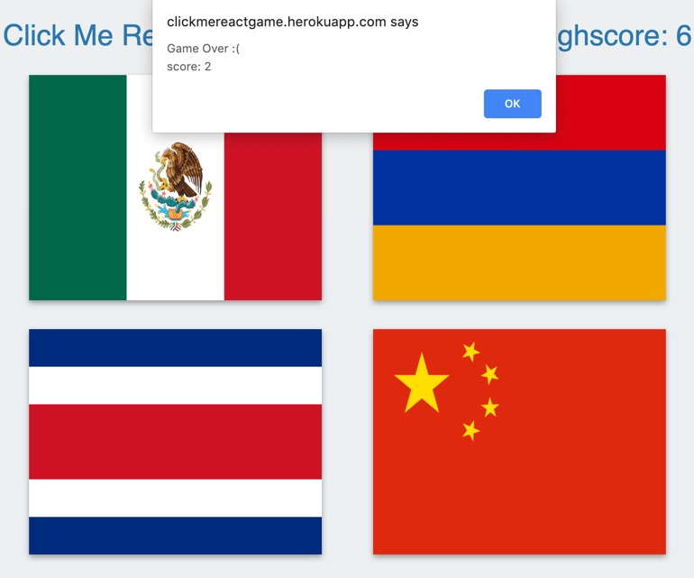

# Click me react game
This react game is to challange a player to memorize the 12 distinct country flags he/she already clicked. If a player is clicking each flag once, he/she will achieve the highest score. The flags suffele automatically after clicking each one. If player clicks the same flag twice, game will be over.

## Screenshots

## Objectives of this project

This app is developed as part of the introductory React mandatory homework assignment. 

## Techonologies used

* React 
* Node.js 
* npm for project setup, build and execution.

[Game Link](https://clickmereactgame.herokuapp.com/)

## Environment Setup
1) Download and Install the latest version of [Node.js & npm](https://nodejs.org/en/download/) on you computer.

## Getting Started

* You may clone the GitHub (https://github.com/ChetBudhathoki/clickmereactgame) repo into your local machine.
* Execute following in the Terminal:
* cd into the directory clickmereactgame.
* install the dependency packages into your machine by running command: `npm install`
* Start the app by executing this command: `npm start` 

## Questions?

Any questions and/or concerns maybe directed to okChet@gmail.com

## Author

**Chet Budhathoki** - [GitHub Profile](https://github.com/ChetBudhathoki)